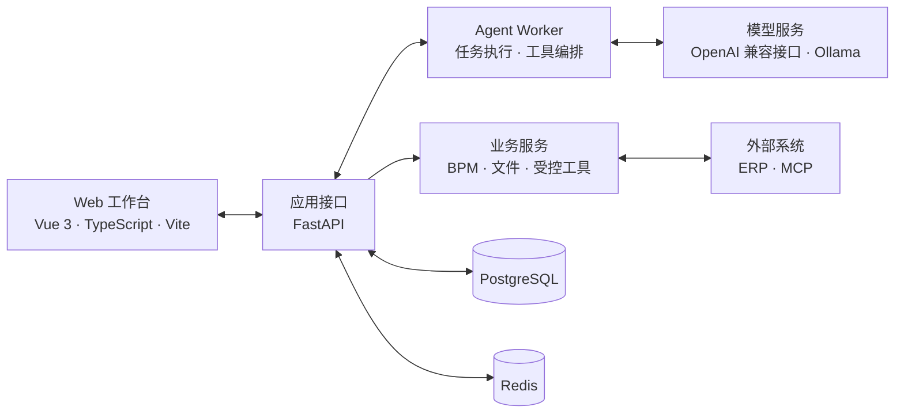

# MoldPilot

面向模具项目协作场景的智能工作台。

MoldPilot 将 Agent 对话、受控工具调用、人工确认、流程审批和操作留痕集中在一个 Web 工作区中。系统采用前后端分离架构，支持接入兼容 OpenAI API 的模型服务或本地 Ollama，并通过独立 Worker 执行 Agent 任务。

> [!IMPORTANT]
> 项目仍在开发中，当前版本主要用于本地开发、业务验证和交互原型迭代。

## 界面预览

<p align="center">
  
</p>

<p align="center"><sub>工作台首页：从会话发起查询、核对和业务任务</sub></p>

<p align="center">
  
</p>

<p align="center"><sub>工具与技能：按部门和风险等级展示当前可用能力</sub></p>

## 主要能力

- 统一的 Agent 会话与流式运行状态
- 查询工具、业务工具和模型调用过程展示
- 重要业务操作的人工确认与执行回执
- BPM 流程编排及审批记录
- 项目资料、操作证据和审计事件留痕
- 多模型配置，支持兼容 OpenAI API 的服务与 Ollama

## 项目架构



### 技术栈

| 层级 | 技术 |
| --- | --- |
| 前端 | Vue 3、TypeScript、Vite、Pinia、Vue Router、bpmn-js |
| 后端 | Python 3.12、FastAPI、SQLAlchemy、Alembic |
| Agent | 独立 Worker、模型适配、工具调用、人工确认 |
| 数据 | PostgreSQL、Redis |
| 集成 | HTTP API、MCP、对象存储 |

## 目录结构

```text
MoldPilot/
├─ backend/             # FastAPI、Agent Worker 与业务服务
├─ web/                 # Vue 3 前端
├─ alembic/             # 数据库迁移
├─ mcp/                 # MCP 服务
├─ tests/               # 后端测试
├─ scripts/             # 开发与运维辅助脚本
├─ docs/                # 产品与技术文档
├─ .env.example         # 环境变量示例
└─ requirements.lock    # Python 依赖锁定文件
```

## 本地启动

以下命令以 Windows PowerShell 为例。

### 1. 环境要求

- Python `3.12`
- Node.js 与 npm
- PostgreSQL
- Redis

### 2. 配置环境变量

在项目根目录复制配置模板：

```powershell
Copy-Item .env.example .env
```

编辑 `.env`，至少确认以下配置：

```dotenv
MOLD_DATABASE_URL=postgresql+psycopg://用户名:密码@127.0.0.1:5432/moldpilot
MOLD_MIGRATION_URL=postgresql+psycopg://用户名:密码@127.0.0.1:5432/moldpilot
MOLD_REDIS_URL=redis://127.0.0.1:6379/0
MOLD_WORKER_SECRET=替换为本地随机密钥
```

如需运行 Agent，再配置模型服务，并将 `MOLD_LLM_ENABLED` 设为 `true`。完整字段和示例见 [`.env.example`](.env.example)。请勿提交包含真实凭据的 `.env`。

请先在 PostgreSQL 中创建名为 `moldpilot` 的空数据库。Redis 可以使用本机服务；也可以通过仓库中的 Compose 文件启动：

```powershell
docker compose -f docker-compose.redis.yml up -d
```

Compose 服务监听 `127.0.0.1:56379`，使用它时请将 `.env` 中的 `MOLD_REDIS_URL` 改为 `redis://127.0.0.1:56379/0`。

### 3. 安装后端依赖并初始化数据库

```powershell
py -3.12 -m venv .venv
.\.venv\Scripts\python.exe -m pip install -r requirements.lock

$env:PYTHONPATH='backend'
.\.venv\Scripts\python.exe -m alembic upgrade head
.\.venv\Scripts\python.exe -m app.bootstrap --username admin --name 管理员
```

创建管理员时，命令行会提示输入初始密码，密码长度至少为 12 个字符。

### 4. 安装前端依赖

```powershell
Set-Location web
npm ci
Set-Location ..
```

### 5. 启动服务

分别打开三个 PowerShell 终端，并在项目根目录运行以下命令。

终端一：启动 API。

```powershell
$env:PYTHONPATH='backend'
.\.venv\Scripts\python.exe -m uvicorn app.api:app --host 127.0.0.1 --port 8000 --no-access-log
```

终端二：配置好模型后启动 Agent Worker。

```powershell
$env:PYTHONPATH='backend'
.\.venv\Scripts\python.exe -m app.agent_worker
```

终端三：启动前端。

```powershell
Set-Location web
npm run dev -- --host 127.0.0.1
```

启动完成后访问：

- Web 工作台：<http://127.0.0.1:5173>
- API 健康检查：<http://127.0.0.1:8000/api/health>

## 开发验证

后端测试：

```powershell
$env:PYTHONPATH='backend'
.\.venv\Scripts\python.exe -m pytest
```

前端检查与构建：

```powershell
Set-Location web
npm run test
npm run build
```

## 相关文档

- [产品约定](docs/PRODUCT_CONTRACT.md)
- [开发状态](docs/DEVELOPMENT_STATUS.md)
- [需求覆盖](docs/REQUIREMENTS_TRACEABILITY.md)
