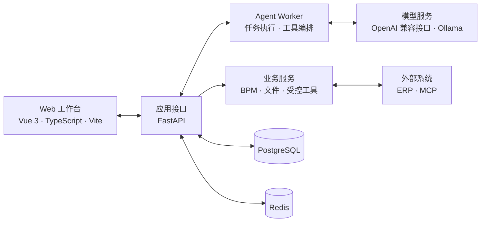

# MoldPilot

面向模具项目协作场景的智能工作台。

MoldPilot 将 Agent 对话、受控工具调用、人工确认、流程审批和操作留痕集中在一个 Web 工作区中。系统采用前后端分离架构，支持接入兼容 OpenAI API 的模型服务或本地 Ollama，并通过独立 Worker 执行 Agent 任务。

> [!IMPORTANT]
> 项目仍在开发中，当前版本主要用于本地开发、业务验证和交互原型迭代。

## 界面预览

<p align="center">
  
</p>

<p align="center"><sub>工作台首页：从会话发起查询、核对和业务任务</sub></p>

<p align="center">
  
</p>

<p align="center"><sub>工具与技能：按部门和风险等级展示当前可用能力</sub></p>

## 主要能力

- 统一的 Agent 会话与流式运行状态
- 查询工具、业务工具和模型调用过程展示
- 重要业务操作的人工确认与执行回执
- BPM 流程编排及审批记录
- 项目资料、操作证据和审计事件留痕
- 供应商连接下管理多个模型，支持 OpenAI 兼容目录检测和 Ollama tags；聊天按会话独立选择模型与受支持的思考档位

## 项目架构



### 技术栈

| 层级 | 技术 |
| --- | --- |
| 前端 | Vue 3、TypeScript、Vite、Pinia、Vue Router、bpmn-js |
| 后端 | Python 3.12、FastAPI、SQLAlchemy、Alembic |
| Agent | 独立 Worker、模型适配、工具调用、人工确认 |
| 数据 | PostgreSQL、Redis |
| 集成 | HTTP API、MCP、对象存储 |

## 目录结构

```text
MoldPilot/
├─ backend/             # FastAPI、Agent Worker 与业务服务
├─ web/                 # Vue 3 前端
├─ alembic_core/        # 通用智能体宿主迁移链
├─ backend/domain_packs/mold/alembic_domain/ # 模具领域独立迁移链
├─ backend/domain_packs/# 可替换业务包（含各自 ERP、Tool、Skill、MCP）
├─ tests/               # 后端测试
├─ scripts/             # 开发与运维辅助脚本
├─ docs/                # 产品与技术文档
├─ .env.example         # 环境变量示例
└─ requirements.lock    # Python 依赖锁定文件
```

## 本地启动

以下命令以 Windows PowerShell 为例。

### 1. 环境要求

- Python `3.12`
- Node.js 与 npm
- PostgreSQL
- Redis

### 2. 配置环境变量

在项目根目录复制配置模板：

```powershell
Copy-Item .env.example .env
```

编辑 `.env`，至少确认以下配置：

```dotenv
AGENT_DATABASE_URL=postgresql+psycopg://用户名:密码@127.0.0.1:5432/moldpilot
AGENT_MIGRATION_URL=postgresql+psycopg://用户名:密码@127.0.0.1:5432/moldpilot
AGENT_REDIS_URL=redis://127.0.0.1:6379/0
AGENT_WORKER_SECRET=替换为本地随机密钥
```

如需运行 Agent，再配置模型服务，并将 `AGENT_LLM_ENABLED` 设为 `true`。旧版 `MOLD_*` 宿主变量仍可读取，但新部署统一使用 `AGENT_*`；Mold 领域策略和 ERP 连接仍使用 `MOLD_*`。完整字段和示例见 [`.env.example`](.env.example)。请勿提交包含真实凭据的 `.env`。

请先在 PostgreSQL 中创建名为 `moldpilot` 的空数据库。本项目默认复用本机 Redis 服务（`127.0.0.1:6379`），不要求 Docker。可先只读检查状态；需要时再显式启动并初始化业务 stream：

```powershell
.venv\Scripts\python.exe scripts\dev_redis.py status
.venv\Scripts\python.exe scripts\dev_redis.py start --execute
.venv\Scripts\python.exe scripts\dev_redis.py init-stream --execute
```

`MOLD_REDIS_HOME` 可指向本机 Redis 安装目录；当前开发机使用 `D:\Redis`。仓库中的 Compose 文件只保留为其他环境显式选择的备用方案，不是默认启动路径。

### 3. 安装后端依赖并初始化数据库

以下初始化说明仅适用于经批准的新建空库，**不是日常启动或故障恢复步骤**。当前工作区已有 `127.0.0.1:55432/agent_db` 数据库，禁止为启动服务重新初始化或自动迁移；结构变更须另行审查、批准。

```powershell
py -3.12 -m venv .venv
.\.venv\Scripts\python.exe -m pip install -r requirements.lock

$env:PYTHONPATH='backend'
.\.venv\Scripts\python.exe scripts\migrate.py upgrade head
.\.venv\Scripts\python.exe -m app.bootstrap --username admin --name 管理员
```

迁移命令会根据 `AGENT_BUSINESS_PACK` 按顺序执行版本链：默认 `mold`
先运行通用 Core，再运行模具领域仓库；`template` 只运行不包含项目、采购、
工程联络或物流表的 Core。现有 MoldPilot 历史库会先升级并校验旧链，再原地
登记两个新版本 head，业务数据不复制、不重写。不要绕过 `scripts/migrate.py`
直接运行固定 Alembic 配置；定位单层问题时才显式使用 `--stage`。

多台电脑共用数据库时，由持有完整迁移链的一台电脑执行升级。其他开发机可在
本机 `.env` 设置 `AGENT_STARTUP_MIGRATIONS=verify`，一键启动会通过只读事务
检查实际运行数据库的 ORM 结构，不修改版本号或业务数据。缺表、缺字段、类型、
主键、非空要求或索引/外键不兼容时仍会停止；允许额外表、可省略的字段及只约束
新增空字段的约束。数据库版本在本地不存在时会明确显示警告，不伪造迁移记录。

`verify` 检查不代表完整迁移历史、触发器、函数或新业务语义已经验证，缺失的
迁移及配套代码仍应同步。默认 `upgrade` 保持自动升级；显式执行
`scripts/migrate.py upgrade head` 和 `check` 仍严格校验迁移链。
可单独运行 `scripts/migrate.py verify`，或运行 `一键启动.bat --check` 检查启动前置条件。

创建管理员时，命令行会提示输入初始密码，密码长度至少为 12 个字符。

### 4. 安装前端依赖

```powershell
Set-Location web
npm ci
Set-Location ..
```

Mold ERP 设计上传 MCP 随业务包存放在 `backend/domain_packs/mold/mcp/erp-design-upload`。
ERP 工程产出的 npm 包不复制进 Agent 仓库；设置 `MOLD_ERP_DESIGN_MCP_PACKAGE` 为该 tarball
的实际路径后，在 MCP 目录执行 `npm run setup`。业务包也可用
`MOLD_ERP_DESIGN_MCP_ROOT` 显式覆盖运行时目录。

### 5. 启动服务

Windows 日常启动可使用根目录 `一键启动.bat`。它先验证后端导入，再用 `scripts/check_runtime.py` 检查本地 PostgreSQL：连接与 SQL 有超时，子进程整体限时 20 秒，连接从建立时强制只读，并核对版本表和必需表列。不可用或结构不匹配就明确退出，不自动执行迁移、盖章或建表。`一键启动.bat --check` 只检查，不启动服务，也不打开浏览器。

本开发机的数据库由独立 Windows 服务 **`moldpilot-postgresql-55432`** 托管，自动启动，使用原 `.local/pgdata`，账号为低权限 `NetworkService`，失败后按 5/15/60 秒重启。现有 `postgresql-x64-18`（5432，另一数据目录）不是该项目实例，不能用它替代。数据库不再依附启动终端；关闭 API/Worker 窗口不会停止数据库。数据库日志在 `.local/pgdata/log/`。不要在服务运行时另用 `pg_ctl start` 创建重复实例。

如需在这台开发机重新安装/校正该服务，在**普通 PowerShell** 中显式执行下列管理脚本，完成只读配置核对后再批准系统 UAC；它不初始化数据库、不执行迁移、不改其他 PostgreSQL 服务：

```powershell
powershell.exe -NoProfile -ExecutionPolicy Bypass -File .\scripts\install_local_postgres_service.ps1
```

服务注册要求已有 PostgreSQL 18 二进制（默认 `D:\PostgreSQL\18`）及原数据目录。数据盘当前为 exFAT，不具备 NTFS ACL 隔离；迁移至 NTFS 须另行安排，不能在恢复启动时擅自移动数据。自动启动/失败恢复配置不等于已完成真实重启或故障注入验收。

如果需要逐项手动启动，分别打开六个 PowerShell 终端，并在项目根目录运行以下命令。

终端一：启动 API。

```powershell
$env:PYTHONPATH='backend'
.\.venv\Scripts\python.exe -m uvicorn app.api:app --host 127.0.0.1 --port 8000 --no-access-log
```

终端二：配置好模型后启动 Agent Worker。

```powershell
$env:PYTHONPATH='backend'
.\.venv\Scripts\python.exe -m app.agent_worker
```

终端三：启动消息 Worker。该进程负责 PostgreSQL Outbox → Redis Streams 投递，
同时扫描持久化的审批提醒/到期计时器；进程重启后会从数据库继续处理未完成计时器。

```powershell
$env:PYTHONPATH='backend'
.\.venv\Scripts\python.exe -m app.message_worker
```

终端四：启动仅监听 `127.0.0.1:18081` 的本地 PaddleOCR GPU 服务。先在 `.env` 配置随机 `AGENT_OCR_SERVICE_TOKEN`；CPU Profile 只允许人工切换，不会在 GPU 失败后自动降级。

```powershell
docker compose -f docker-compose.ocr.yml --profile gpu up -d paddleocr-gpu
```

终端五：启动 PDF 文档识别 Worker。配置 `AGENT_OCR_SERVICE_*` 与 `AGENT_DOCUMENT_MODEL_*` 后，该进程执行文本层提取、按需 PaddleOCR、不可变页面缓存及纯文本模型分类/结构化；不会向文档模型发送 PDF 或图片。上传 PDF 的保存事务直接登记预分类任务，不创建附件 Agent Run，也不要求先确认接收。分类结果、类型选择和本人确认在原会话自动展示；确认销售合同后自动排队字段提取。确认仍校验所有权、当前权限、版本、内容哈希和 HumanIntent 凭证。

文档模型可使用 `AGENT_DOCUMENT_MODEL_PROFILE_ID` 固定引用已保存的 OpenAI 兼容模型配置，不复制 Key、不随聊天窗口切换。GLM-5.3-Flash 配合 `AGENT_DOCUMENT_MODEL_REASONING_EFFORT=low`；它不支持关闭思考。文档请求使用流式接收，`READ_TIMEOUT` 限制无响应等待，`TOTAL_TIMEOUT` 限制单批生成时长。生成期间续租，批次完成后保存已校验的候选及不含正文的完成凭据；重试复用匹配输入/模型/协议指纹的批次，整个作业成功后才提供可复核字段。结构或来源校验失败最多有界重提取一次，不静默丢弃无效字段。完成和失败通过当前权限校验后通知上传人，并可返回原会话。

图片页以 300 DPI 为目标上限，大画幅页面会按比例收缩到 OCR 服务安全像素限制内，不会放宽服务端输入防护。

```powershell
$env:PYTHONPATH='backend'
.\.venv\Scripts\python.exe -m app.document_worker
```

终端六：启动前端。

```powershell
Set-Location web
npm run dev -- --host 127.0.0.1
```

启动完成后访问：

- Web 工作台：<http://127.0.0.1:5173>
- API 健康检查：<http://127.0.0.1:8000/api/health>

## 供应商、多模型与思考档位

在设置 → 模型配置中编辑供应商连接，输入 Base URL 和 Key 后点击“检测模型”。检测只请求模型目录，不自动执行生成、不保存配置、不证明每个模型都有调用权限或支持 Agent 工具。目录可搜索、多选添加；不支持目录的供应商可手动添加准确模型 ID。每个模型独立设置输出/上下文预算与思考协议；未知模型默认不发送思考参数，手工协议声明仍须核对供应商支持情况。GLM-5.3/Flash 的已知档位为 low/high/max；原生 OpenAI 推理模板发送 `reasoning_effort` 和 `max_completion_tokens`，不附带固定 temperature；Ollama 单独使用 `think`。不会通过调整温度或增加 token 额度来假装改变思考程度，仍保留既有 8192 输出预算上限。

聊天输入框的模型浮层按供应商分组，滑条为离散档位。选择保存在当前用户/会话偏好中，发送任务时后端锁定模型身份、预算和档位；排队、重试与确认续办不随系统默认模型漂移。普通账号仍只使用管理员默认模型，不因新增界面而扩大模型管理权限。选择只作用于后续任务，不影响已发送任务或文档 OCR 固定配置。

现有模型配置读取时兼容投影，不自动改写文件；管理员明确保存时才升级为供应商/模型分离的 v3 JSON。原 profile ID 保留为模型 ID，Key 仅在供应商连接保存一份，接口不回显；旧配置写接口不能降级 v3。修改目标地址不能默带原 Key。更新有 revision 冲突检查、文件锁和原子替换。回退旧版程序前需同时核对配置格式，不能让旧版本直接覆盖 v3 文件。

目录请求有认证、CSRF、DNS/固定目标地址、TLS/SNI、无重定向及大小/数量限制；分页未完整获取会明确提示。前端效果、真实供应商目录和具体模型调用仍需实际验收，不能以模拟网络回归替代。

## 开发验证

后端测试：

```powershell
$env:PYTHONPATH='backend'
.\.venv\Scripts\python.exe -m pytest
```

前端检查与构建：

```powershell
Set-Location web
npm run test
npm run build
```

## 相关文档

- [产品约定](docs/PRODUCT_CONTRACT.md)
- [开发状态](docs/DEVELOPMENT_STATUS.md)
- [需求覆盖](docs/REQUIREMENTS_TRACEABILITY.md)
