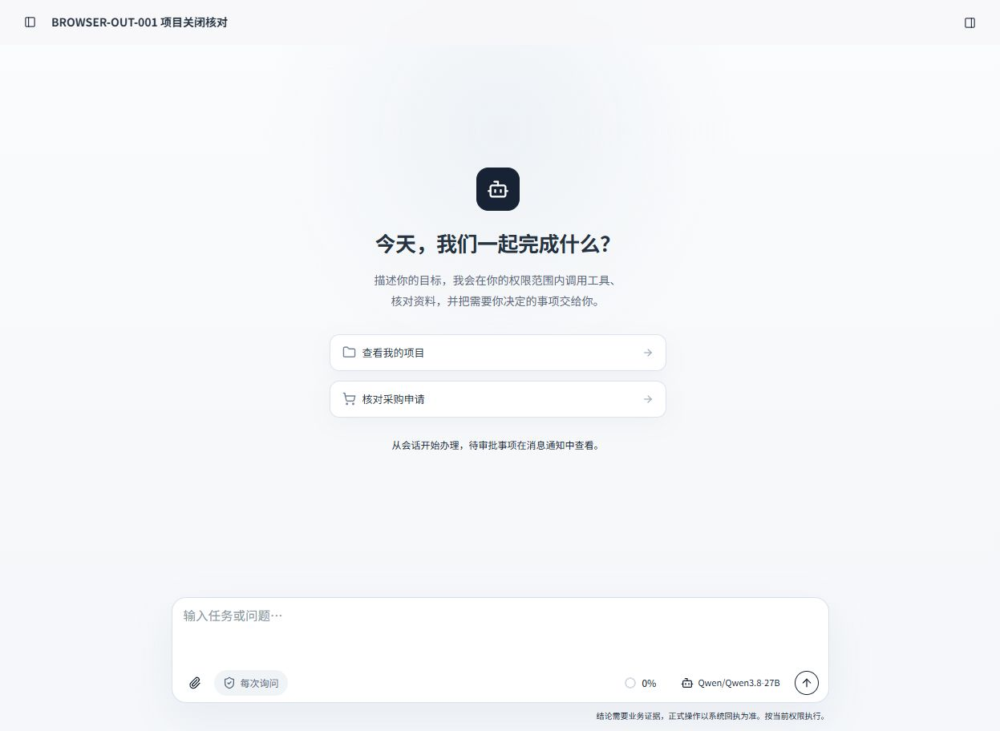
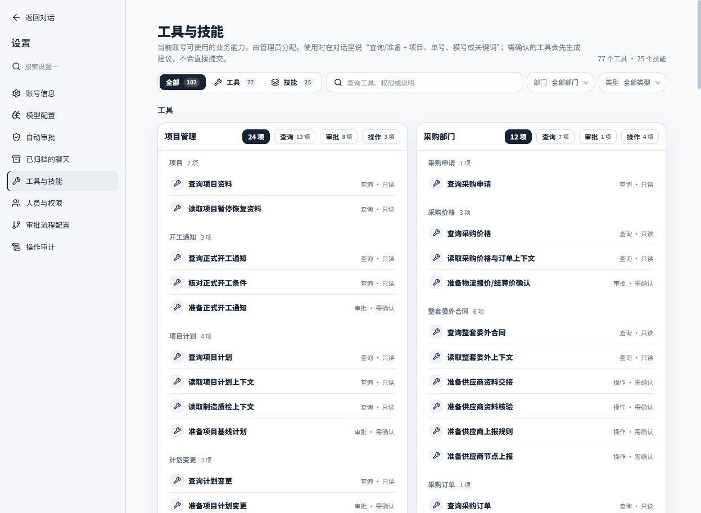
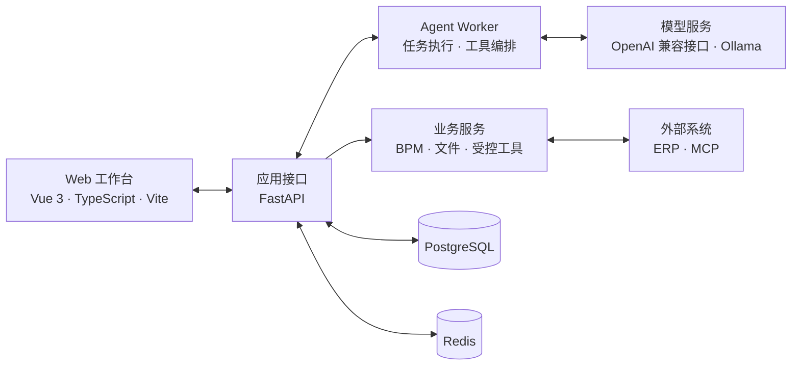

# MoldPilot

面向模具项目协作场景的智能工作台。

MoldPilot 将 Agent 对话、受控工具调用、人工确认、流程审批和操作留痕集中在一个 Web 工作区中。系统采用前后端分离架构，支持接入兼容 OpenAI API 的模型服务或本地 Ollama，并通过独立 Worker 执行 Agent 任务。

> [!IMPORTANT]
> 项目仍在开发中，当前版本主要用于本地开发、业务验证和交互原型迭代。

## 界面预览

<p align="center">
  
</p>

<p align="center"><sub>工作台首页：从会话发起查询、核对和业务任务</sub></p>

<p align="center">
  
</p>

<p align="center"><sub>工具与技能：按部门和风险等级展示当前可用能力</sub></p>

## 主要能力

- 统一的 Agent 会话与流式运行状态
- 查询工具、业务工具和模型调用过程展示
- 重要业务操作的人工确认与执行回执
- BPM 流程编排及审批记录
- 项目资料、操作证据和审计事件留痕
- 多模型配置，支持兼容 OpenAI API 的服务与 Ollama

## 项目架构



### 技术栈

| 层级 | 技术 |
| --- | --- |
| 前端 | Vue 3、TypeScript、Vite、Pinia、Vue Router、bpmn-js |
| 后端 | Python 3.12、FastAPI、SQLAlchemy、Alembic |
| Agent | 独立 Worker、模型适配、工具调用、人工确认 |
| 数据 | PostgreSQL、Redis |
| 集成 | HTTP API、MCP、对象存储 |

## 目录结构

```text
MoldPilot/
├─ backend/             # FastAPI、Agent Worker 与业务服务
├─ web/                 # Vue 3 前端
├─ alembic_core/        # 通用智能体宿主迁移链
├─ backend/domain_packs/mold/alembic_domain/ # 模具领域独立迁移链
├─ backend/domain_packs/# 可替换业务包（含各自 ERP、Tool、Skill、MCP）
├─ tests/               # 后端测试
├─ scripts/             # 开发与运维辅助脚本
├─ docs/                # 产品与技术文档
├─ .env.example         # 环境变量示例
└─ requirements.lock    # Python 依赖锁定文件
```

## 本地启动

以下命令以 Windows PowerShell 为例。

### 1. 环境要求

- Python `3.12`
- Node.js 与 npm
- PostgreSQL
- Redis

### 2. 配置环境变量

在项目根目录复制配置模板：

```powershell
Copy-Item .env.example .env
```

编辑 `.env`，至少确认以下配置：

```dotenv
AGENT_DATABASE_URL=postgresql+psycopg://用户名:密码@127.0.0.1:5432/moldpilot
AGENT_MIGRATION_URL=postgresql+psycopg://用户名:密码@127.0.0.1:5432/moldpilot
AGENT_REDIS_URL=redis://127.0.0.1:6379/0
AGENT_WORKER_SECRET=替换为本地随机密钥
```

如需运行 Agent，再配置模型服务，并将 `AGENT_LLM_ENABLED` 设为 `true`。旧版 `MOLD_*` 宿主变量仍可读取，但新部署统一使用 `AGENT_*`；Mold 领域策略和 ERP 连接仍使用 `MOLD_*`。完整字段和示例见 [`.env.example`](.env.example)。请勿提交包含真实凭据的 `.env`。

请先在 PostgreSQL 中创建名为 `moldpilot` 的空数据库。Redis 可以使用本机服务；也可以通过仓库中的 Compose 文件启动：

```powershell
docker compose -f docker-compose.redis.yml up -d
```

Compose 服务监听 `127.0.0.1:56379`，使用它时请将 `.env` 中的 `AGENT_REDIS_URL` 改为 `redis://127.0.0.1:56379/0`。

### 3. 安装后端依赖并初始化数据库

```powershell
py -3.12 -m venv .venv
.\.venv\Scripts\python.exe -m pip install -r requirements.lock

$env:PYTHONPATH='backend'
.\.venv\Scripts\python.exe scripts\migrate.py upgrade head
.\.venv\Scripts\python.exe -m app.bootstrap --username admin --name 管理员
```

迁移命令会根据 `AGENT_BUSINESS_PACK` 按顺序执行版本链：默认 `mold`
先运行通用 Core，再运行模具领域仓库；`template` 只运行不包含项目、采购、
工程联络或物流表的 Core。现有 MoldPilot 历史库会先升级并校验旧链，再原地
登记两个新版本 head，业务数据不复制、不重写。不要绕过 `scripts/migrate.py`
直接运行固定 Alembic 配置；定位单层问题时才显式使用 `--stage`。

创建管理员时，命令行会提示输入初始密码，密码长度至少为 12 个字符。

### 4. 安装前端依赖

```powershell
Set-Location web
npm ci
Set-Location ..
```

Mold ERP 设计上传 MCP 随业务包存放在 `backend/domain_packs/mold/mcp/erp-design-upload`。
ERP 工程产出的 npm 包不复制进 Agent 仓库；设置 `MOLD_ERP_DESIGN_MCP_PACKAGE` 为该 tarball
的实际路径后，在 MCP 目录执行 `npm run setup`。业务包也可用
`MOLD_ERP_DESIGN_MCP_ROOT` 显式覆盖运行时目录。

### 5. 启动服务

分别打开四个 PowerShell 终端，并在项目根目录运行以下命令。

终端一：启动 API。

```powershell
$env:PYTHONPATH='backend'
.\.venv\Scripts\python.exe -m uvicorn app.api:app --host 127.0.0.1 --port 8000 --no-access-log
```

终端二：配置好模型后启动 Agent Worker。

```powershell
$env:PYTHONPATH='backend'
.\.venv\Scripts\python.exe -m app.agent_worker
```

终端三：启动消息 Worker。该进程负责 PostgreSQL Outbox → Redis Streams 投递，
同时扫描持久化的审批提醒/到期计时器；进程重启后会从数据库继续处理未完成计时器。

```powershell
$env:PYTHONPATH='backend'
.\.venv\Scripts\python.exe -m app.message_worker
```

终端四：启动前端。

```powershell
Set-Location web
npm run dev -- --host 127.0.0.1
```

启动完成后访问：

- Web 工作台：<http://127.0.0.1:5173>
- API 健康检查：<http://127.0.0.1:8000/api/health>

## 开发验证

后端测试：

```powershell
$env:PYTHONPATH='backend'
.\.venv\Scripts\python.exe -m pytest
```

前端检查与构建：

```powershell
Set-Location web
npm run test
npm run build
```

## 相关文档

- [产品约定](docs/PRODUCT_CONTRACT.md)
- [开发状态](docs/DEVELOPMENT_STATUS.md)
- [需求覆盖](docs/REQUIREMENTS_TRACEABILITY.md)
