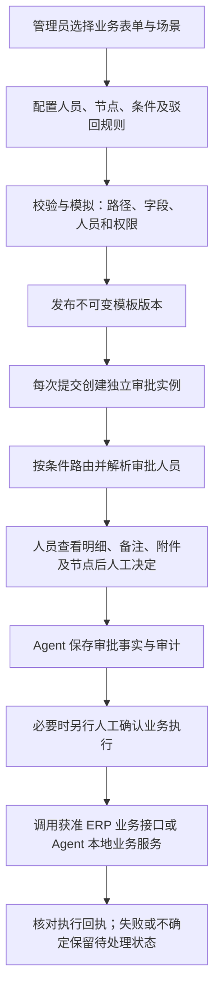
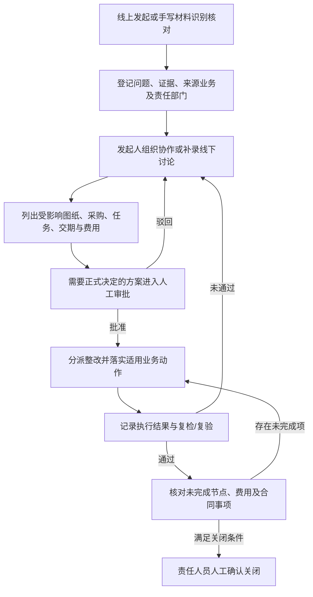

# 通用 BPM 与工程联络单开发约束

更新：2026-09-15。依据用户最新确认、需求 V1.1 FR-039、043～047、059～063、078～090。本文补充并纠正实现边界，不替代完整需求，不声明以下能力已全部实现。

工程联络单最新优先约束：它是发起人组织的灵活协作过程，不强制由管理员预设流程。支持上传手写材料识别后核对入档，以及发起人线上创建、选择责任部门、线下讨论后线上记录。下文管理员发布模板的规则适用于标准审批模板，不应强加到联络单全部协作活动。正式审批与协作记录分开，具体方案见 ENGINEERING_CONTACT_COLLABORATION.md。

最新优先约束：新流程按管理员自由维护的类别及模板名称管理，不要求从固定业务和采购类别中选取。发起人选择类别、模板、已发布版本，历史已发布版本可显式选择，草稿不能发起。已发起实例继续使用原版本。下文固定类别适用范围和仅最新版本可用的旧描述由本条覆盖；既有模板不就地篡改。资料模板、Excel 映射和动态条件后续按 BPM_MATERIAL_TEMPLATES.md 实现，用户已确认设计清单与核算清单通常有固定模板。

## 1. 业务配置与运行

- 同一套 Python BPM 内核、表单和任务机制承载各类审批。新增常规审批路线通过配置实现；新增业务字段、确定性校验或执行接口仍需对应业务开发，不能靠流程图自动产生业务功能。
- 审批流程中的业务动作按能力目录分发：采购下单、拆单复用 ERP 现有业务接口；辅材、办公用品、试模料所缺业务，以及发货车辆、物流信息维护由 Agent 开发。调用位置在审批前后都不改变该动作的归属，不另写一套 ERP 已有的下单或拆单逻辑。
- 管理员只能选择后端登记并验证过的业务动作，不能配置任意接口或绕过人工确认。新增采购是否适用 ERP 通用下单/拆单接口必须先核对，明确订单的唯一事实来源；不能为凑流程闭环在两个系统重复建单。
- 管理员配置指定用户、部门/角色候选人、项目责任人等人员规则，支持配置串行、会签、或签、条件分支及退回目标。运行时记录实际人员解析结果；无人可办理则阻塞并通知管理员，不默认批准。
- 条件只能读取登记的业务字段，以受限、带类型的运算符执行；禁止配置任意 Python、SQL、脚本或外部 URL。条件与字段权限校验由后端执行，LLM 不决定条件是否满足。
- 先通过表单、节点连通性、分支覆盖、默认出口、退回路径、人员规则及执行动作绑定校验，再发布。模拟使用明确标记的测试参数；实际阈值和人员由管理员配置。
- 保存草稿可编辑；发布版本不可修改；修改后重新发布新版本。新提交使用明确选定的有效版本，运行实例固定原版本。管理员撤权和账号停用仍立即影响办理资格；不能通过冻结模板继续使用失效权限。
- 审批任务资格与业务数据权限都必须满足。配置审批人不会自动开放跨部门、跨采购域或保密字段；资料不足以判断时提示权限问题并阻塞，不让审批人盲签。
- 命中必须驳回规则时展示原因，由审批人员确认驳回；不得继续同意，也不得通过退回、加签或 Agent 委托绕过同一版本的规则。硬性业务校验不得由流程配置放宽。
- 审批页展示提交人、提交时间、业务详细信息、备注、附件及版本、当前节点、审批人员、命中规则和历史。关键业务数据更改后，旧审批不能沿用到新版本。
- 普通节点可在管理员政策、用户明确委托、本人席位、当前权限和业务规则的交集内支持 Agent 代办；未配置时按人工办理。当前已提供 `AgentApprovalDelegation` 委托表、显式节点标记 `agent_auto_approval`、可选安全条件 `agent_auto_policy.condition`、个人授权设置页和输入框权限模式下拉：只有本轮会话选择 `delegated_auto`，且节点允许、安全条件明确满足、用户有效委托、当前席位和权限仍成立、材料完整且规则允许 `APPROVE` 时才会自动同意。默认“每次询问”模式始终只生成待确认请求；强制人工节点不得由任何自动化绕过，模型不能伪造用户确认。管理员策略模板仍待补齐。

## 2. 同一引擎的三个配置验收场景

| 场景 | 表单及条件来源 | 验收重点 |
|---|---|---|
| 新模/改模设计上传 | 模具引用、设计类型、图纸版本、提交说明、附件；按管理员配置识别新模/改模或其他已登记分支 | 两条路径由同一模板配置或独立模板版本表达；修改人员和条件不改引擎代码，不调用 ERP 设计审批 |
| 采购价格审批 | 原订单/询价引用、采购域、供应商、明细价格、币种、税口径、报价版本及差异；阈值由管理员配置 | 固定被审批价格版本；变价必须重新审批；审批通过后正式下单仍须人工确认；不调用 ERP 价格审批 |
| 工程联络单中需要正式审批的方案 | 问题与证据、责任、对策、影响清单、交期/费用变化、要求日期 | 在发起人组织的协作中挂接正式审批，复用权限、任务、人工确认与历史机制；不强制整个联络单预先绑定管理员模板，批准不直接标记异常关闭 |

标准审批场景的顺序参考 ERP 和需求文档，由管理员配置确认；工程联络单的协作责任部门和处理过程由发起人组织、按实际过程记录。不得在代码中写死测试人员、公司金额门槛或强制让每个部门采用同一路线。

## 3. 工程联络单：异常处理闭环

- 依据 FR-082，覆盖设计、装配、加工、采购、质检、试模、外协等异常，以及适用客户设变、降本和改善。只配置五金采购域的人员只能查询和办理其获授权部分，不能从联络单摘要泄露其他域的信息。
- 按 FR-083 保留客户、项目、模具、产品料号/料品、申请日期、来源、责任部门、类别、紧急程度、说明、对策、要求/实际完成时间、工时、金额、附件、版本及审批记录。
- 按 FR-084～089，分别记录方案、影响对象及拟采取的继续/暂停/取消/返工/重下达动作。普通异常未影响批准计划时不强制重排；只变更实际受影响的对象，保留历史和未受影响任务。
- 工程联络单、方案版本、审批实例、整改任务和复验记录分别建模、关联并留痕。审批状态与业务处理状态分开；审批通过、执行回执、复验通过与最终关闭不能互相代替。
- ERP 仅提供可引用的既有业务事实及经审查的执行能力；Agent 新增异常状态与联络单保存在 Agent 数据库。不复制 ERP 实时台账，不调用 ERP 异常发起、责任认定、审批或关闭流程。
- ERP 审批/异常与已有业务路由分别核对。钢料拆单/不拆单两种业务路径已由用户确认按 ERP 原样复用，包含其内置业务后续，不要求将其拆除。其他执行接口若依赖旧审批或异常状态，登记具体衔接事实，不直写 ERP 库或伪造旧审批状态；不能用旧流程代替 Agent BPM。

## 4. 事务与验收要求

- Agent 本地审批决定、实例状态、审计及 outbox 事件在同一数据库短事务提交。审批采用版本/并发控制和幂等键，重复点击不产生重复决定。
- ERP 调用在本地事务之外执行。先持久化待执行操作与人工确认绑定的参数版本，再请求 ERP；分别保存成功、明确失败及结果不确定。超时不自动重发正式写操作，通过业务查询核对结果。
- 必须验证：三类场景复用同一引擎；配置分支及人员变更；发布后版本固定；空候选人阻塞；撤权后不能办理；强制驳回无法同意；资料变版使旧确认失效；重复审批不重复执行；ERP 超时不误报成功；整改未完成或复验未通过不得关闭。
- 禁止 ERP 审批及异常流程调用的约束应进入适配器能力白名单和测试；白名单仅限定可调用范围，不替代人工确认、当前权限和业务前置校验。
# 流程版本与界面补充（2026-09-14）

管理员可以查看每一版的完整节点、审批人员、条件和适用范围。草稿支持直接修改，保存时校验读取后的内容是否已被他人改变；已发布版本不能覆盖，修改内容需另存为下一版本草稿后发布。保存分配下一版本号，发布保留该号；例如第一版已发布，另存第二版草稿，修改该草稿仍为第二版，发布后成为第二版已发布。旧审批实例始终使用发起时所绑定的版本。新申请按流程编码使用最新已发布版，尚未发布的草稿不参与选择。

业务提交人按实际材料选择适用的已发布流程，采购类别及新模/改模约束由后端核验。人员配置不等于业务授权，模板选择不允许绕过当前数据权限。

界面统一使用中文业务描述，不将字段编码、比较运算符、流程编码或节点标识作为产品文案显示。内部标识保留稳定值，业务编号和用户原文不做自动翻译。
