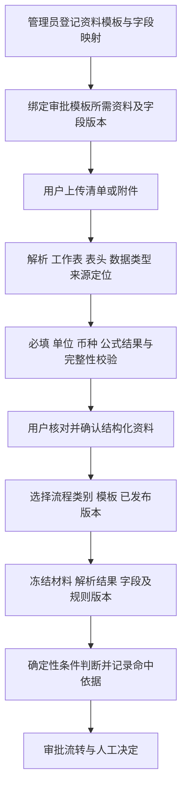

# 通用审批的资料模板与条件配置

2026-09-14 用户确认：设计清单、模具核算清单通常使用固定模板。以下为后续实现合同，不能据此认定 Excel 导入、附件解析或动态条件已交付。

## 当前实现证据（2026-09-14）

已增加 backend/app/material_rules.py，提供独立于文件解析的资料字段契约校验与确定性规则求值。BPM 的 material_contract 可定义表头字段和多张明细表，分支、驳回与模拟共用此解释器。旧已发布模板仍使用原有六字段解释器，避免改变历史规则含义。

支持文本、Decimal 数值、布尔、日期、关联币种的金额字段；指定稳定行 ID、任意行、全部行、过滤后的 SUM/COUNT/MIN/MAX、AND/OR。新增规则严格传播未知值：即便另一个条件或行已命中，只要参与判断的数据缺失，仍返回待核对。空原始明细、重复行 ID、币种不一致、类型错误和计算预算超限均不通过；只有已知非空资料经过有效过滤后没有匹配行时，COUNT 可以明确为 0。

模拟返回条件结果、行 ID、字段显示名、实际值、比较值及原因；明细解释展示上限100行，仍评估完整允许范围并记录省略数。规则最多200个节点、嵌套8层，每表最多5000行，单次求值最多50000步。金额不做隐式换汇，Decimal 汇总采用足够精度，原资料与规则不被求值过程修改。

tests/test_material_rules.py 覆盖同一行反例、排序后的稳定引用、缺字段不放行、四类汇总、过滤、Decimal/混合币种、日期、布尔、附件核对字段、表达式注入与计算边界，并通过实际 Spiff 引擎验证路径和强制驳回。

已新增独立资料模板登记、草稿修改、发布、复制新版本 API 和 Vue 管理页面。管理员可维护表头、多张明细表、中文字段名、类型、单位及金额关联币种字段。审批模板可以绑定一个已发布资料模板版本，后端复制字段契约并核对一致性；目前单个绑定可包含多张明细表，多份独立资料模板绑定仍待扩展。迁移 94d51bc730ef 已应用开发库与隔离测试库，资料模板已发布版本有数据库更新/删除保护；该保护不代表其他表均已有相同触发器。

tests/test_material_templates.py 覆盖草稿并发、发布不可变、数据库保护、版本复用、绑定一致性、权限及模拟绑定。最新全后端168项测试通过，Vue类型检查与构建通过。实际浏览器已验证合成设计清单的数量、币种、单价字段配置，发布第一版、复制第二版草稿，以及审批模板仅能选择已发布第一版；观察区间无控制台错误或警告。没有创建正式业务审批或调用 ERP。

尚缺：Excel 列映射与适配/解析、文件存储、用户核对与确认、与业务对象绑定、字段级授权、动态条件编辑器和动态模拟界面。现有正式提交 API 不接受任意客户端 material_data；对声明 material_contract 但尚无已确认资料绑定的流程明确返回 MATERIALS_NOT_BOUND。资料模板结构绑定不等于实际材料已经核对。后续需用持久化资料绑定替换该接入保护，不能简单删除保护或用模拟数据作为正式材料。前端复制草稿保留 material_contract，避免丢失已定义资料要求。

## 三类配置分开管理

- 流程类别：管理员自由维护加工、采购、委外等分类，不由固定业务枚举或采购类别限制。
- 资料模板：登记设计清单、模具核算清单等数据结构、字段类型、明细表、Excel 列映射和版本。
- 审批模板：配置人员、节点、条件、驳回规则及引用的资料模板版本。发起人按类别、模板、已发布版本选择；审批内容与数据权限仍由实际业务材料校验。

同一资料模板可以复用于多个流程，一个审批流程也可以要求多份资料模板及附件。条件来源可为表单、Excel 明细、经核对的附件解析结果，以及受控业务工具取得的事实；不把类别名称用作接口调用路由。

## 字段与文件契约

字段具有稳定标识、中文名称、类型、单位/币种、必填规则、是否可用于条件判断和资料读取要求。导入适配登记文件类型、工作表、表头行、明细起止区域、列名/别名；不依赖用户当前屏幕排序或单一固定列号。

Excel 优先读取原生单元格；禁止执行宏、外部链接或任意公式代码。公式没有可用计算结果、模板版本不匹配、缺列、重复表头、单位或币种不明确时进入核对状态。是否支持受限公式计算单独实现并测试，不能将未实现公式默认为零。PDF/图片使用 OCR 或文档解析，提取结果及关键字段需按已确认规则人工核对。

每个值保留文件版本、工作表、原始行号/单元格或页码、解析版本、核对人和核对时间。稳定明细 ID 用于引用特定业务行；原始行号用于追溯，不随前端排序改变。

## 条件编辑器

选择数据源 → 明细范围 → 判断字段 → 类型支持的比较方式 → 比较值或另一字段 → 目标节点。支持 AND/OR 组合，后端验证受控表达式，不执行用户输入的 Python、SQL 或任意脚本。

明细范围必须显式选择：指定明细、任一明细、全部明细、过滤后的明细、合计/计数/最大/最小值。示例：任一明细同时满足数量大于10和单价大于500，必须在同一行成立，不能由两行分别命中后拼接为满足。多行总量和单行数量是不同条件。空集合、缺字段、类型错误或未核对值应明确成为资料缺失状态，不能利用空集合的逻辑真值自动通过。

附件条件区分：是否上传、数量、文件类型、指定版本、人工核对状态，以及附件内容中已登记且经核对的字段。“已上传文件”不能等同于“合同已签署”。模型可建议字段映射和规则草稿，管理员确认配置；模型输出不直接决定正式分支。

模拟从绑定的资料模板生成输入控件，支持导入合成/授权测试资料，显示命中哪一行、哪个字段、实际值与阈值、所选分支和未命中/缺资料原因。不再以固定数量、金额、采购类别几个输入框作为完整模拟能力。

## 冻结、权限与验收

审批实例绑定流程版本、资料模板版本、字段映射版本、原文件版本/哈希和人工确认的数据快照。上传新文件不会修改已发起实例；修订、重提按新资料版本重新确认。需要当前状态的业务前置另行查询并记录时间，不能悄悄替换原审批材料。

条件评估前完成行/列/附件权限检查；无权资料不能进入 Agent 提示词或返回的命中解释。权限不足不能扩大授权以便利审批。条件结果及来源定位与节点流转在本地事务中留痕，审批不直接产生 ERP 事实；ERP 已有业务动作仍通过已确认受控接口复用。

需验证：设计清单与核算清单两类固定模板、多工作表、列顺序变化、同一行复合条件、任意/全部/指定行、缺数据、跨币种、附件缺失/未核对、版本替换、越权字段、发布后旧实例可复现，以及相同数据下模拟与运行结果一致。

实现参考：BPM 的变量与网关条件、决策表表达式；当前 Python 技术栈不变。相关原理可见 [Spiff 数据文档](https://spiff.works/docs/spiffworkflow/bpmn/data)、[FEEL 列表条件](https://docs.camunda.io/docs/components/modeler/feel/language-guide/feel-list-expressions/)。借鉴数据与规则机制，不因此引入另一个后端技术栈。
