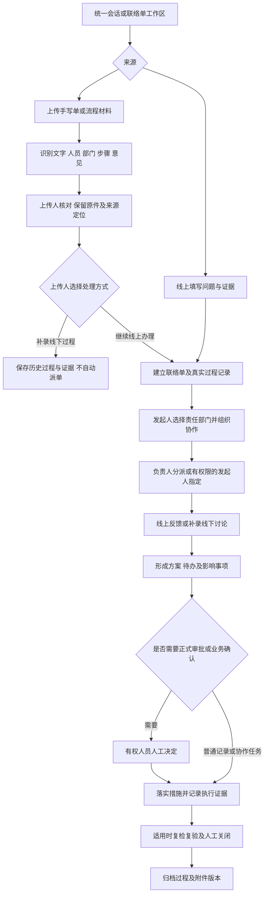
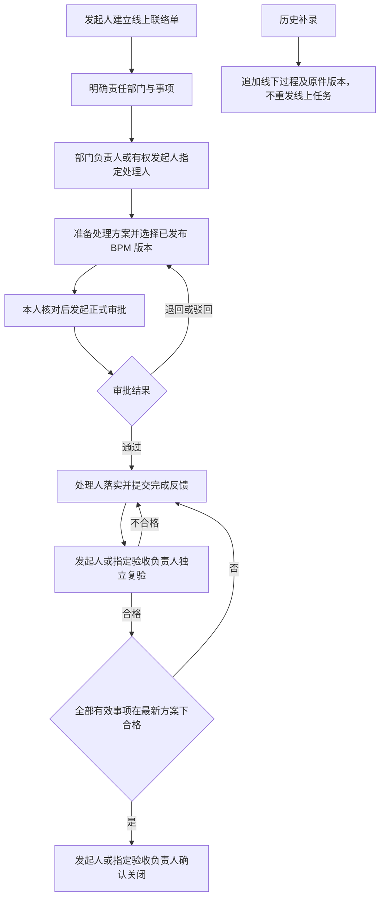

# 工程联络单：发起人组织的灵活协作

2026-09-15。记录本轮已确认需求、建议实现和待确认事项，不代表功能已交付。

## 已确认范围

工程联络单用于异常及相关事项处理，不固定为管理员预先配置的审批链。支持两种入口：上传手写材料，识别并经用户核对后系统记录；发起人在线创建，选择责任部门，组织处理或将线下讨论过程在线留痕。仍属于独立 Agent 项目，不调用 ERP 的异常或审批流程。

用户已确认：上传人选择“补录线下过程”或“继续线上办理”。选定责任部门后，由部门负责人分派具体处理人；发起人具备相应权限时，也可以直接指定。负责人身份用于分派资格，仍须满足事项范围和操作权限；处理资格、资料访问与正式审批资格分别校验。

统一 AI 会话支持上传、整理问题、提出责任部门建议和形成记录草稿；右侧工作区提供人工核对、责任部门选择、过程查看与办理。AI 不可用时仍可人工登记。Agent 建议不能代替真实人员的确认或责任认定。

## 建议的处理结构

上传人核对处理方式及待执行步骤后再创建线上任务。历史补录只保存已发生过程和证据，不自动重发待办、执行业务动作或生成冒名审批。线上续办须明确已完成与待执行步骤，不把整张纸质流程从头重跑。历史材料的归档状态与业务事项的最终关闭状态分开保存。

- 联络单作为长期业务对象，关联责任部门、参与者、讨论记录、方案版本、协作任务、正式审批、执行与复验记录。协作任务可以按实际需要追加、调整或撤销，不把整个过程强制编成已发布模板。
- 建议为每条过程记录保存录入人、实际参与人、实际发生时间、系统录入时间、来源类型和附件引用。代录他人意见明确标为代录；是否需被记录人确认另行定义。不能冒充该人员已在线签署。
- OCR 保留原文件及页码/区域，标记不确定的内容，核对后形成结构化草稿。姓名识别结果不能直接绑定账号或伪造电子审批；识别失败支持人工录入。
- 责任部门和任务变化留痕，已完成意见及历史责任不覆盖。受影响的任务、方案与正式审批是否需要重新确认由版本和业务规则判断；使用版本校验和幂等键防止负责人及发起人同时分派产生重复任务。
- 选择部门或加入联络单不自动授予全项目数据权限；展示、附件访问和任务办理都检查当前授权。部门负责人分派，有权限的发起人可直接指定；没有有效负责人或合格处理人时提示待分派，不将全部部门人员默认设为审批人。发起人直接指定的范围由管理员授予的权限控制。
- 线下讨论可以作为过程和证据记录。异常方案、延期、报价接单等已约定强制人工事项仍由有权人员确认；一般协作反馈不等于正式批准，OCR 签名不等于系统审批。
- 正式审批通过不等于措施完成，措施完成不等于复验或关闭。按联络单实际影响校验适用的整改、复验及关闭要求；只补录历史材料时，如何认定最终状态仍需明确。
- 管理员维护用户、部门、权限与不可绕过的业务规则；发起人在这些权限内组织每张联络单的处理路线。可复用 BPM 的任务、意见、权限和审计机制，但不要求发起人具备流程模板发布权。

## 待确认与实施缺口

已确认的上传双模式和人员分派机制按上述约束实现，无需重复确认。后续实现时仍需细化发起后谁可调整责任、线下代录意见的确认方式、最终关闭责任及历史补录的状态认定。不将尚未确认的细节当作用户已确认规则。

## 本次实现与冻结范围（2026-09-15）

OCR 按用户要求暂缓。本轮实现线上联络业务闭环，使用独立联络服务及通用 BPM，不增加常驻业务菜单。发起、补充记录、部门协作、分派、反馈、附件关联、方案审批、指定验收负责人、撤销未反馈事项、复验及关闭均封装为 prepare_contact_* 工具，先保存操作建议，用户核对并确认后才执行。

- 方案冻结责任事项及提交时的附件版本，保存在独立 contact_resolution 表，复用同一 BusinessSubject / ApprovalInstance 引擎。批准方案不直接执行 ERP、修改订单或改变客户承诺；影响客户交期须补充人工确认依据。
- 事项或附件变更使旧方案不能继续同意或用于关闭；需新方案审批及新方案下复验。已有审批历史保留。反馈、复验、正式审批和关闭分别记录，合格复验不允许处理人自己确认，超级管理员也不能绕过人员分离。
- 用户确认关闭责任为发起人或管理员指定验收负责人；管理员指定前检查被指定人已有联络读取、复验、关闭权限，指定身份不授予额外权限，办理时重新查验授权。
- 发起人可撤销尚未反馈事项，保留原责任和操作记录；已反馈事项不能撤销抹去证据。复验不合格退回原处理人，历史反馈和不合格依据保留。关闭后不再新增/改派/追加业务记录。
- 所有正式动作仅从本人登录会话取得确认挑战；模型及 Worker 不持有挑战。确认重查资源版本、授权、责任资格，业务变化、回执、审计与 outbox 同一事务提交。
- 历史补录只记录已发生事实，不发起线上方案审批，也不冒充线上验收关闭。
- 附件可上传 PDF/PNG/JPG/DOCX/XLSX，人工确认后关联，保留原件哈希和历史版本。附件下载重新校验当前联络权限；上传者撤权后不能借原上传地址绕过限制。当前本地存储用于开发，生产须配置启用版本保留的私有 S3 兼容存储。未验证生产存储部署、杀毒或 OCR。
- 右侧仅查看当前联络材料、进度、过程及关联审批。待审批进入消息通知；管理员配置通过左下角账号菜单→设置。业务主要从统一会话办理。

验证记录见 DEVELOPMENT_STATUS.md。自动化测试使用独立 agent_test 合成库，涵盖方案审批、反馈退回、复验、指定负责人、关闭、权限撤销、旧确认阻断、材料变更、原件及版本。真实模型和页面验证与自动化测试分别记载，不把一次合成验证视为生产业务验收。

尚未覆盖：自由协作流程图形画布、任意历史补录的业务最终状态认定、完整成本/计划影响与 ERP 执行动作回执关联、附件安全扫描及生产对象存储恢复演练。OCR 暂缓；ERP 真实联调等待用户启动既有系统。本轮联络协作关闭不会自动关闭旧 engineering_change 对象、ERP 异常或项目。

用户要求本轮联络功能收尾后打包并暂停开发；后续恢复需以交接说明和最新约定继续，不能按旧文档恢复 ERP 式菜单。
