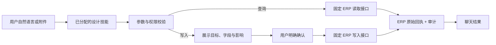

# 设计工具与技能使用说明

更新时间：2026-09-16  
范围：MoldPilot 当前注册的设计能力，共 **52 个工具**、**10 个技能**。

其中，`query_design_route_context` 和 `design_route_context_review` 是 MoldPilot 本地项目数据能力；其余 **51 个工具、9 个技能** 通过随 Mold 业务包配置的 ERP 设计 MCP 调用现有 ERP 接口。这里的“工具”是可被模型调用的操作，“技能”是引导模型选择工具、安排步骤和控制确认的业务流程。

## 使用前提与触发规则

用户不需要在聊天里填写工具名或 JSON。可以直接说“查模具 M-001 的 BOM”“上传这份钢料表”“把设变 62 提交审批”。系统从对话意图中选择已分配给当前账号的技能和工具，并把已知编号、附件和确认语转换为接口参数。

要真正出现并可执行，需同时满足：

1. 管理员已把相应工具或技能分配给该账号，并授予 `design_route.read`（查询）或 `design_route.execute`（写入）权限；超级管理员默认可见全部能力。
2. ERP MCP 配置已可连接：`backend/domain_packs/mold/mcp/erp-design-upload/.env` 中的 `ERP_DESIGN_UPLOAD_BASE_URL`、`ERP_DESIGN_UPLOAD_TOKEN` 和超时配置正确；依赖包位置通过 `MOLD_ERP_DESIGN_MCP_PACKAGE` 配置。
3. 文件类操作只能使用**当前聊天中、当前用户上传的附件**：新模/BOM 为 XLSX，修模图纸为 DXF，标准件为当前聊天上传的文件。
4. 查询可直接执行；所有会改变 ERP 的工具都先展示目标和字段，用户在下一句明确回复“确认”“确认导入”“按以上执行”等后才执行。删除、审批、提交、执行等不会因模糊表述自动发生。

如果信息不足，系统会追问而不是猜测。例如查询需模号、订单号或记录 ID；修改需当前记录 ID 和版本号；上传需目标目录或模具 ID。

实现上，通用入口在 [`backend/app/tool_gateway.py`](../backend/app/tool_gateway.py)，业务注册、严格参数模型、文件校验和 ERP 调用均归属于 [`backend/domain_packs/mold`](../backend/domain_packs/mold)。适配层只把请求转发到固定的 MCP 工具，不在 MoldPilot 数据库复制 ERP 订单、BOM 或审批数据；每次返回都带 ERP 来源、时间和限制说明，并记录审计事件。

## 设计工具逐项索引（52 个）

这一节用于快速确认工具是否已封装；下一节开始给出每一项的触发语、输入和实现细节。

| 编号 | 工具 | 用途 |
|---:|---|---|
| 1 | `query_design_route_context` | 查询 MoldPilot 项目内的设计、BOM、路线、计划和工程联络影响。 |
| 2 | `erp_design_parse_new_mold_upload` | 解析当前聊天的新模钢料/五金 XLSX 并创建 ERP 上传会话。 |
| 3 | `erp_design_get_drawing_status` | 查询新模上传会话的图纸处理状态。 |
| 4 | `erp_design_get_upload_result` | 获取新模上传会话的解析明细和异常。 |
| 5 | `erp_design_validate_rows` | 校验新模上传明细是否可导入。 |
| 6 | `erp_design_reprice_rows` | 重算新模上传明细的价格字段。 |
| 7 | `erp_design_get_approval_config` | 获取新模导入前的 ERP 审批配置。 |
| 8 | `erp_design_rematch_no_drawing` | 对 ERP 明确标记为历史无图的明细重新匹配图纸。 |
| 9 | `erp_design_import_new_mold` | 将已校验的新模明细导入 ERP。 |
| 10 | `erp_design_submit_upload_change` | 将解析后的设计上传清单提交为 ERP 变更请购。 |
| 11 | `erp_design_query_orders` | 查询 ERP 设计订单。 |
| 12 | `erp_design_query_drawing_versions` | 查询 ERP 图纸版本和发布状态。 |
| 13 | `erp_design_query_bom` | 查询 ERP BOM 明细。 |
| 14 | `erp_design_query_bom_report` | 查询 BOM 汇总、物料、采购进度和待采购报表。 |
| 15 | `erp_design_query_changes` | 查询 ERP 设变申请和流程状态。 |
| 16 | `erp_design_query_standard_hardware` | 查询 ERP 厂内标准件图纸目录。 |
| 17 | `erp_design_query_densities` | 查询设计材质密度配置。 |
| 18 | `erp_design_query_group_rules` | 查询设计分组与采购拆分规则。 |
| 19 | `erp_design_query_group_keywords` | 查询设计分组关键词。 |
| 20 | `erp_design_get_record` | 读取一条 ERP 订单、图纸、BOM、设变或基础配置详情。 |
| 21 | `erp_design_compare_drawing_versions` | 对比两个 ERP 图纸版本。 |
| 22 | `erp_design_analyze_change` | 分析 ERP 设变对模具、零件、工序和合同的影响。 |
| 23 | `erp_design_get_mold_repair_approval` | 查询修模改模图纸异常审批批次。 |
| 24 | `erp_design_get_mold_repair_outsource_approval` | 查询委外定标触发的修模图纸异常审批。 |
| 25 | `erp_design_get_mold_repair_processor_response` | 查询加工商对修模图纸异常的响应。 |
| 26 | `erp_design_update_order_item` | 修改 ERP 设计订单的一条物料明细。 |
| 27 | `erp_design_save_scrap_decision` | 保存设计订单明细的闲置料使用决定。 |
| 28 | `erp_design_release_scrap_decision` | 释放设计订单明细占用的闲置料决定。 |
| 29 | `erp_design_manage_order` | 删除、审批或重新提交 ERP 设计订单。 |
| 30 | `erp_design_manage_order_draft_scrap` | 保存或释放 ERP 设计草稿明细的闲置料决定。 |
| 31 | `erp_design_create_density` | 新增设计材质密度。 |
| 32 | `erp_design_update_density` | 修改设计材质密度。 |
| 33 | `erp_design_delete_density` | 删除设计材质密度。 |
| 34 | `erp_design_create_group_rule` | 新增设计分组和采购拆分规则。 |
| 35 | `erp_design_update_group_rule` | 修改设计分组和采购拆分规则。 |
| 36 | `erp_design_toggle_group_rule` | 启用或停用设计分组规则。 |
| 37 | `erp_design_delete_group_rule` | 删除设计分组规则。 |
| 38 | `erp_design_create_group_keyword` | 新增设计分组关键词。 |
| 39 | `erp_design_update_group_keyword` | 修改设计分组关键词。 |
| 40 | `erp_design_delete_group_keyword` | 删除设计分组关键词。 |
| 41 | `erp_design_upload_standard_hardware` | 上传当前聊天附件到 ERP 厂内标准件目录。 |
| 42 | `erp_design_rename_standard_hardware` | 重命名 ERP 厂内标准件图纸。 |
| 43 | `erp_design_delete_standard_hardware` | 删除 ERP 厂内标准件图纸目录。 |
| 44 | `erp_design_manage_change` | 创建、修改、删除、提交、评审或确认 ERP 设变申请。 |
| 45 | `erp_design_query_change_items` | 查询 ERP 设变申请的明细。 |
| 46 | `erp_design_manage_change_items` | 新增、修改、删除或执行 ERP 设变明细。 |
| 47 | `erp_design_upload_mold_repair_drawing` | 上传当前聊天 DXF 修模改模图纸并生成异常分析。 |
| 48 | `erp_design_manage_mold_repair` | 确认数量、提交审批、关联订单或回复加工商。 |
| 49 | `erp_design_manage_bom` | 新增、修改或删除 ERP BOM。 |
| 50 | `erp_design_query_bom_shortage` | 查询模具或零件的 ERP BOM 缺料。 |
| 51 | `erp_design_import_bom` | 将当前聊天 XLSX BOM 导入指定 ERP 模具。 |
| 52 | `erp_design_download_file` | 下载 ERP 图纸、标准件、修模图纸包或 BOM 导出文件。 |

## 10 个设计技能

| 技能 | 何时由对话触发 | 用户应提供的内容 | 内部执行方式 |
|---|---|---|---|
| `design_route_context_review` 设计 BOM 与路线上下文核对 | “设计进度怎样”“正式图纸版本”“这个 BOM 的加工路线”“改版会影响计划吗” | 项目 ID，或项目编号/名称、设计单号、图纸版本、物料、计划任务、工程联络任一线索 | 调用本地 `query_design_route_context`，从本项目的设计单、BOM、路线、计划和工程联络读取证据；不生成图纸，也不写入 ERP。 |
| `erp_new_mold_design_upload` ERP 新模设计上传流程 | “上传新模钢料表”“解析这份五金表”“检查图纸匹配后导入” | 当前聊天上传 XLSX；钢料或五金；交期、紧急程度、请购原因、备注（导入时） | 解析文件建立 ERP 会话，轮询图纸状态，取得并校验明细；必要时重算价格、查询审批配置；确认后导入或提交变更请购。 |
| `erp_design_workspace_review` ERP 设计资料核对 | “查 ERP 设计订单”“查图纸版本”“BOM 采购进度”“这个设变影响什么” | 模号、订单号、图纸版本、BOM/设变 ID、关键词或筛选条件 | 只读查询 ERP 订单、图纸、BOM、设变、标准件、基础配置及修模审批状态。 |
| `erp_design_order_adjustment` ERP 设计明细与闲置料调整 | “修改设计订单明细”“这条闲置料要部分使用”“释放占用的余料” | 订单/明细 ID；当前 `detailVersion`；材质、规格、原因；余料库存和数量（如适用） | 先查订单和明细，确认当前版本和可编辑状态；确认后写入明细修改或闲置料决定。 |
| `erp_design_master_data_maintenance` ERP 设计基础数据维护 | “新增 718 的密度”“停用某分组规则”“维护分组关键词” | 记录 ID（修改/删除时）；材质标识和密度，或规则/关键词字段 | 先读现有记录；确认后维护材质密度、分组规则、分组关键词。删除和停用均会再次要求明确确认。 |
| `erp_design_standard_hardware_maintenance` ERP 厂内标准件图纸维护 | “上传标准件图纸”“改这个标准件文件名”“删除标准件目录” | 当前聊天附件和目标文件夹；或现有相对路径、新文件名 | 先查询目录和文件；确认后上传、改名或删除。不能引用模型编造的本机路径。 |
| `erp_design_change_management` ERP 设变申请与明细管理 | “创建设变”“提交设变 62”“评审/确认设变”“执行设变明细” | 设变 ID、明细 ID；操作类型；变更原因/前后内容/影响等业务字段 | 先查询设变、详情和影响，再通过受限的设变或设变明细接口创建、修改、提交、评审、确认或执行。 |
| `erp_design_order_lifecycle` ERP 设计订单完整办理 | “审批设计订单”“重新提交订单”“删除草稿订单”“处理草稿闲置料” | 订单请求 ID；审批版本 `approvalVersion`；草稿 ID、序号、闲置料决定 | 先读取订单阶段和版本，确认后调用订单审批/重提/删除或草稿闲置料接口。 |
| `erp_design_mold_repair` ERP 修模改模图纸处理 | “上传修模图”“确认异常数量”“提交修模审批”“回复加工商” | 当前聊天 DXF；异常/批次/订单 ID、加工商组标识和业务字段 | 上传 DXF 后由 ERP 生成异常分析；读取审批和响应状态后，确认数量、提交审批、关联订单或提交加工商响应。 |
| `erp_design_bom_maintenance` ERP BOM 维护与导入 | “新建 BOM”“修改 BOM”“查缺料”“导入这份 BOM 表” | BOM ID（修改/删除）；模具 ID；字段内容；当前聊天 XLSX（导入） | 先查询 BOM、报表或缺料范围；确认后增改删，或将当前 XLSX 导入指定 ERP 模具。 |

## 52 个设计工具

### 1. MoldPilot 本地设计上下文（1 个）

| 工具 | 触发条件 | 对话至少输入 | 实现方式 |
|---|---|---|---|
| `query_design_route_context` | 询问项目设计、正式图纸、BOM、路线、计划或工程联络影响 | **项目 ID**，或一个唯一线索：项目编号/名称、设计单号、图纸版本、物料编号/名称、计划任务、工程联络标题 | 在本地 Agent 数据库查找可见项目，汇总设计单、物料、路线、关联计划和工程联络；多项目匹配时返回候选并要求用户指定。只读。 |

### 2. ERP 新模设计上传（9 个）

| 工具 | 触发条件 | 对话至少输入 | 实现方式 |
|---|---|---|---|
| `erp_design_parse_new_mold_upload` | “解析/上传新模钢料表或五金表” | 当前聊天 XLSX；类型为 `steel`（钢料）或 `hardware`（五金）；可选设计订单子类型 | 校验附件归属和 XLSX 后发送给 ERP，建立 `session_id` 上传会话。解析成功不等于已导入。 |
| `erp_design_get_drawing_status` | “图纸处理好了吗”“查上传进度” | `session_id` | 查询本人上传会话的 ERP 图纸处理状态；可要求同时返回结果。 |
| `erp_design_get_upload_result` | “查看已解析明细” | `session_id` | 读取 ERP 解析明细和异常，供后续人工核对。 |
| `erp_design_validate_rows` | “校验这批明细能不能导入” | `session_id`、钢料/五金类型、要校验的 `preview_rows`；可选模号 | ERP 校验图纸匹配、字段和导入条件；失败时不允许导入。 |
| `erp_design_reprice_rows` | “重新核价/价格字段变了” | `session_id`、钢料/五金类型、`preview_rows`；可选模号 | 调 ERP 重新计算价格相关字段，再由用户确认新的明细。 |
| `erp_design_get_approval_config` | “这批数据会走什么审批” | `session_id` | 读取 ERP 导入前的审批配置，只读。 |
| `erp_design_rematch_no_drawing` | ERP 明确提示“历史无图”，用户要求重新匹配 | `session_id`，并明确确认 | 仅能操作当前用户的会话；向 ERP 发起重新匹配请求，随后仍需查状态，不能把请求当作图纸已归档。 |
| `erp_design_import_new_mold` | “确认导入这批新模明细” | `session_id`、类型、已核对 `preview_rows`、交期 `YYYY-MM-DD`；可选紧急程度、原因、备注、重复导入许可 | 先在后台重新校验，只有 ERP 校验通过且用户确认导入时才发起导入。ERP 回执是创建结果。 |
| `erp_design_submit_upload_change` | “把解析后的清单提交为变更请购” | 目标会话/模号、变更类型/原因、紧急度和待提交明细；明确确认 | 把受校验的 `payload` 发送到 ERP 固定变更请购接口。 |

### 3. ERP 设计工作台查询（15 个）

以下工具大多接受“筛选条件”。对话中可给模号、订单号、关键字、分页或业务状态；系统转换成 ERP `query` 参数。若接口返回多个候选，会展示候选而不猜测目标。

| 工具 | 触发条件 | 对话至少输入 | 实现方式 |
|---|---|---|---|
| `erp_design_query_orders` | “查设计订单/订单状态” | 模号、订单号、关键字或其他筛选条件 | 调 ERP 设计订单只读查询。 |
| `erp_design_query_drawing_versions` | “查图纸版本/发布状态” | 图号、模号、版本或关键字 | 调 ERP 图纸版本只读查询。 |
| `erp_design_query_bom` | “查 BOM 明细” | 模号、BOM ID、零件或关键字 | 调 ERP BOM 只读查询。 |
| `erp_design_query_bom_report` | “看 BOM 汇总/物料汇总/采购进度/待采购” | 报表类型：模具汇总、物料汇总、采购进度或待采购；可选筛选 | 调 ERP 对应 BOM 报表。 |
| `erp_design_query_changes` | “查设变申请和流程状态” | 设变号、模号、状态或关键字 | 调 ERP 设变列表查询。 |
| `erp_design_query_standard_hardware` | “查厂内标准件图纸目录” | 文件名、目录、相对路径或关键字 | 调 ERP 标准件目录查询。 |
| `erp_design_query_densities` | “查材质密度配置” | 材质标识或关键字（可省略） | 调 ERP 密度配置查询。 |
| `erp_design_query_group_rules` | “查设计分组/采购拆分规则” | 关键词、分类、状态（可省略） | 调 ERP 分组规则查询。 |
| `erp_design_query_group_keywords` | “查分组关键词” | 关键词（可省略） | 调 ERP 分组关键词查询。 |
| `erp_design_get_record` | “查看这一条订单/图纸/BOM/设变/规则的详情” | 资源类型和记录 ID | 按固定资源类型读取单条 ERP 详情。 |
| `erp_design_compare_drawing_versions` | “比较图纸两个版本” | 起始版本 ID、目标版本 ID | 调 ERP 图纸版本比较接口。 |
| `erp_design_analyze_change` | “分析这个设变的影响” | 设变 ID，或模具/零件/工序/合同筛选 | 调 ERP 设变影响分析，只读。 |
| `erp_design_get_mold_repair_approval` | “查修模图纸异常审批批次” | `batch_id` | 读取 ERP 修模改模图纸异常审批批次。 |
| `erp_design_get_mold_repair_outsource_approval` | “查委外定标触发的修模审批” | `approval_order_id` | 读取 ERP 委外相关修模图纸异常审批。 |
| `erp_design_get_mold_repair_processor_response` | “查加工商是否响应修模图纸异常” | 加工商组标识 `group_token`、`order_id` | 读取 ERP 加工商响应状态。 |

### 4. ERP 设计订单明细与闲置料（5 个）

| 工具 | 触发条件 | 对话至少输入 | 实现方式 |
|---|---|---|---|
| `erp_design_update_order_item` | “改这条设计明细的材质/规格” | `detail_id`、修改原因；材质标识和/或规格 | 先以订单查询确认可编辑状态；确认后携带原因更新指定明细。 |
| `erp_design_save_scrap_decision` | “使用/部分使用/跳过这条闲置料” | `detail_id`、当前 `detail_version`、决定；部分/使用时还需库存 ID 和数量 | ERP 保存闲置料决定并使用版本字段防止并发覆盖。 |
| `erp_design_release_scrap_decision` | “释放已经占用的闲置料” | `detail_id`、当前 `detail_version` | ERP 释放该明细的闲置料决定。 |
| `erp_design_manage_order` | “删除/审批/重新提交设计订单” | 操作 `delete`/`approve`/`resubmit`、订单 `request_id`；审批需 `approvalVersion` | 先读取订单版本，确认后调用 ERP 订单生命周期接口。 |
| `erp_design_manage_order_draft_scrap` | “保存/释放草稿明细的闲置料决定” | 操作、草稿 ID、序号；保存时还需 ERP 所需的决定和版本字段 | 调 ERP 草稿闲置料接口。 |

### 5. ERP 设计基础数据与标准件（13 个）

| 工具 | 触发条件 | 对话至少输入 | 实现方式 |
|---|---|---|---|
| `erp_design_create_density` | “新增材质密度” | 材质标识、密度 | 确认后新增 ERP 密度配置。 |
| `erp_design_update_density` | “修改材质密度” | `density_id`、材质标识、密度 | 确认后更新 ERP 密度配置。 |
| `erp_design_delete_density` | “删除材质密度” | `density_id` | 先查记录；确认后删除。 |
| `erp_design_create_group_rule` | “新增分组/采购拆分规则” | 关键词；可选分类、匹配范围、前缀、优先级、状态等 | 确认后新增 ERP 规则。 |
| `erp_design_update_group_rule` | “修改分组规则” | `rule_id` 与要变更的规则字段 | 确认后更新 ERP 规则。 |
| `erp_design_toggle_group_rule` | “启用/停用分组规则” | `rule_id`、目标状态 | 确认后切换 ERP 规则状态。 |
| `erp_design_delete_group_rule` | “删除分组规则” | `rule_id` | 先查规则；确认后删除。 |
| `erp_design_create_group_keyword` | “新增分组关键词” | 关键词；可选备注 | 确认后新增 ERP 关键词。 |
| `erp_design_update_group_keyword` | “修改分组关键词” | `keyword_id`、关键词；可选备注 | 确认后更新 ERP 关键词。 |
| `erp_design_delete_group_keyword` | “删除分组关键词” | `keyword_id` | 先查记录；确认后删除。 |
| `erp_design_upload_standard_hardware` | “上传厂内标准件图纸” | 当前聊天附件、目标文件夹名称 | 校验附件归属，确认后把文件临时传给 ERP 固定上传接口。 |
| `erp_design_rename_standard_hardware` | “给标准件图纸改名” | 当前相对路径、新文件名 | 先查询目标；确认后调用 ERP 改名。 |
| `erp_design_delete_standard_hardware` | “删除标准件图纸目录” | 当前相对路径 | 先展示路径；确认后删除 ERP 文件夹。 |

### 6. ERP 设变、修模与 BOM（8 个）

| 工具 | 触发条件 | 对话至少输入 | 实现方式 |
|---|---|---|---|
| `erp_design_manage_change` | “创建、修改、删除、提交、评审、确认设变” | 操作；设变 ID（除新建外）；变更原因、影响、关联模具/零件/工序等字段 | 通过固定 `payload` 调 ERP 设变接口；先展示操作与字段，确认后才写入。 |
| `erp_design_query_change_items` | “查看设变明细” | `change_id` | 读取该 ERP 设变的明细。 |
| `erp_design_manage_change_items` | “新增/批量新增/修改/删除/执行设变明细” | 操作、设变 ID、明细 ID（修改/删除/执行时）和前后内容、原因、费用/工时等字段 | 以固定操作枚举调用 ERP 设变明细接口；执行、删除需确认。 |
| `erp_design_upload_mold_repair_drawing` | “上传修模/改模图纸” | 当前聊天 DXF；是否跳过视觉识别 | 校验 DXF 和附件归属，确认后上传到 ERP 并等待异常分析回执。 |
| `erp_design_manage_mold_repair` | “确认异常数量、提交审批、关联订单、回复加工商” | 操作；异常 ID/批次 ID/订单 ID/组标识中的相关 ID；业务字段 | 先查询批次或响应状态，确认后调用对应修模改模操作。 |
| `erp_design_manage_bom` | “新增/修改/删除 ERP BOM” | 操作；BOM ID（修改/删除）；BOM 字段 | 确认后固定调用 ERP BOM 写入接口。 |
| `erp_design_query_bom_shortage` | “查这个模具/零件缺料” | `mold_id`；可选 `part_id` | 调 ERP BOM 缺料查询，只读。 |
| `erp_design_import_bom` | “把这份 BOM 表导入模具” | 当前聊天 XLSX、目标 `mold_id` | 校验 XLSX 和附件归属；确认后上传并导入 ERP。 |

### 7. ERP 文件取回（1 个）

| 工具 | 触发条件 | 对话至少输入 | 实现方式 |
|---|---|---|---|
| `erp_design_download_file` | “下载图纸/BOM 导出/修模图纸包/标准件目录” | 文件类别和对应标识：图纸 ID、相对路径、审批/异常/批次/订单 ID、组标识、模具 ID 等 | 调用固定 ERP 下载路由，最大 20 MB；内容经校验后存成当前用户、当前会话的私有附件并返回下载链接。支持图纸预览/下载、标准件、修模审批及授权包、BOM 导出。 |

## 对话示例

### 只读查询

用户：`查 ERP 中模号 M-2026-018 的 BOM 和采购进度。`

系统：先使用 `erp_design_query_bom` 和 `erp_design_query_bom_report`；如果模号命中多条记录，会返回候选要求指定，而不是任意选择一条。

### 文件上传并导入

用户：`上传这份新模钢料表，模号 M-2026-018，交期 2026-10-15。`

系统：读取当前聊天 XLSX，调用解析工具，返回 `session_id` 并查询图纸状态。解析完成后展示明细、校验结果和审批配置。

用户：`明细和交期确认，按正常紧急度导入。`

系统：调用导入工具并带 `confirm_import: true`。导入是否成功、创建了什么记录，以 ERP 回执为准。

### 修改型操作

用户：`把设计订单 128 的明细改成材质 P20、规格 300×200，原因是客户图纸改版。`

系统：先查出准确 `detail_id`、当前 `detailVersion` 和可编辑状态，展示拟写入的字段。

用户：`确认修改。`

系统：调用 `erp_design_update_order_item` 并带 `confirm: true`；若 ERP 返回版本冲突，会要求重新查询，绝不复用旧版本重试。

## 实现边界

- ERP 图纸处理排队、文件上传、解析、校验和审批配置读取，不代表请购已创建、审批已通过、采购已下单或物料已到货。
- 设计本地上下文和 ERP 设计数据是两条来源：前者用于 MoldPilot 项目协作，后者以 ERP 实时回执为准，二者不会互相伪造状态。
- 51 个 ERP 工具将源项目中较多的 ERP 端点按业务流程聚合为 9 类技能；工具数量不等于 ERP HTTP 端点数量。聚合工具的操作类型均为受限枚举，不能由对话任意指定 URL 或服务端方法。
